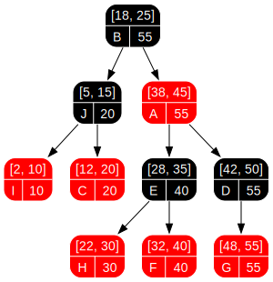

# augmented-rbtree

[![Crates.io][badge-crates]][crate-link]
[![Docs.rs][badge-docs]][docs-link]
[![MSRV][badge-msrv]][msrv-link]
[![License: MIT][badge-license]][license-link]
[![CI][badge-ci]][ci-link]
[](https://coveralls.io/github/ce-bu/augmented-rbtree?branch=main)


An augmented red-black tree for Rust with generic, user-defined per-node statistics.

`augmented-rbtree` automatically maintains augmentation data during inserts, deletes, and rotations.
Build interval trees, order-statistics trees, and other indexed tree structures with `O(log n)` updates and lookups.

## Highlights

- Generic augmentation via the `Augment` trait for customized subtree statistics.
- Red-Black tree fallback without augmentation for standard key-value storage has no augmentation calculation overhead.
- Ordered-map API parity with `BTreeMap`, including range queries, iterators, and `Entry` mechanics.
- Core `no_std` compatibility supporting distinct stack-only and custom allocator profiles.
- Native topology extraction utilities to generate Graphviz layout files for visual debugging.
- Built-in, conditional compilation flags for an optimized `IntervalTree` and `serde` support.
- Extensive test coverage verified through local integration test matrices and example recipes.
- Validated via Miri checks and isolated fuzzing workflows to ensure strict memory safety.

[Examples](https://github.com/ce-bu/augmented-rbtree/tree/main/examples)

[Integration tests](https://github.com/ce-bu/augmented-rbtree/tree/main/tests)

## Installation

Default configuration uses `alloc`:

```toml
[dependencies]
augmented-rbtree = "0.1"
```

## Quick start

Implement `Augment` to define your subtree statistic:

```rust
use augmented_rbtree::{Augment, AugmentedRBTreeFactory};
struct SubtreeCount;

impl<K, V> Augment<K, V> for SubtreeCount {
    type Stats = usize;

    fn compute(
        _k: &K,
        _v: &V,
        left: Option<(&K, &V, &usize)>,
        right: Option<(&K, &V, &usize)>,
    ) -> usize {
        1 + left.map_or(0, |(_, _, &c)| c) + right.map_or(0, |(_, _, &c)| c)
    }
}

fn main() {
    // create a new augmented red-black tree with subtree count augmentation
    // or use the existing `augmentations::SubtreeSize`
    let mut tree = AugmentedRBTreeFactory::<SubtreeCount>::new_tree();
    tree.insert(3, "c");
    tree.insert(1, "a");
    tree.insert(2, "b");
    // Total count is always at the root
    assert_eq!(tree.root_stats(), Some(&3));
    // Standard ordered-map operations
    assert_eq!(tree.get(&2), Some(&"b"));
    assert_eq!(tree.first_key_value_stats(), Some((&1, &"a", &1)));
    // Iterate in sorted order; each entry exposes (key, value, stats)
    for (k, v, count) in &tree {
        println!("key={k}, value={v}, subtree_size={count}");
    }
}
```

Common use cases: order-statistics trees, interval trees, range-sum trees, and range-max trees.

## Feature flags

| Feature | Purpose |
|---|---|
| `alloc` (default) | Use global allocator-backed storage. |
| `interval-tree` | Enable `IntervalTree` type and overlap queries. |
| `serde` | Enable `Serialize`/`Deserialize` support. |
| `allocator-api` | Enable custom allocators on stable via `allocator-api2`. |
| `nightly` | Enable nightly allocator API integration. |

> Note: `allocator-api` and `nightly` are mutually exclusive.

## Interval tree example

```toml
[dependencies]
augmented-rbtree = { version = "0.1", features = ["interval-tree"] }
```

```rust
use augmented_rbtree::interval_tree::{Interval, IntervalTree};

fn main() {
    let mut tree = IntervalTree::new();    
    tree.insert(Interval::new(1, 5), "task A");
    tree.insert(Interval::new(3, 8), "task B");
    tree.insert(Interval::new(10, 15), "task C");
    assert!(tree.any_overlaps(2, 8));
}
```

## Configuration recipes

Use strict `no_std` mode with no default features:

```toml
[dependencies]
augmented-rbtree = { version = "0.1", default-features = false }
```

Use custom allocator support on stable:

```toml
[dependencies]
augmented-rbtree = { version = "0.1", default-features = false, features = ["allocator-api"] }
```

Use nightly allocator API:

```toml
[dependencies]
augmented-rbtree = { version = "0.1", default-features = false, features = ["nightly"] }
```

## Performance

Core operations remain $O(\log n)$ while maintaining augmentation data during balancing and structural updates.

Run benchmarks:

```bash
cargo bench
```

## Visualization (optional)

The crate includes a topology traversal API and a visualization example.

```bash
cargo visualize
```

This runs the example at [`examples/visualization.rs`](examples/visualization.rs) and generates a Graphviz SVG layout.



## MSRV

- Rust 1.87+

## License

Licensed under either of:

- Apache License, Version 2.0 ([LICENSE-APACHE](LICENSE-APACHE) or <http://apache.org/licenses/LICENSE-2.0>)
- MIT License ([LICENSE-MIT](LICENSE-MIT) or <http://opensource.org/licenses/MIT>)

at your option.

## Contributing

See [CONTRIBUTING.md](CONTRIBUTING.md).

<!-- Badges -->

[crate-link]: https://crates.io/crates/augmented-rbtree
[docs-link]: https://docs.rs/augmented-rbtree
[ci-link]: https://github.com/ce-bu/augmented-rbtree/actions
[msrv-link]: https://www.rust-lang.org/
[license-link]: #license

[badge-crates]: https://img.shields.io/crates/v/augmented-rbtree
[badge-docs]: https://docs.rs/augmented-rbtree/badge.svg
[badge-ci]: https://github.com/ce-bu/augmented-rbtree/actions/workflows/ci.yml/badge.svg
[badge-msrv]: https://img.shields.io/badge/MSRV-1.87-blue.svg
[badge-license]: https://img.shields.io/badge/license-MIT-blue.svg
